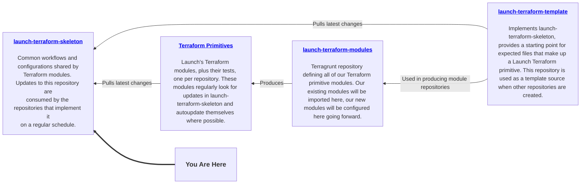

# Terraform Skeleton

This skeleton defines the set of core configurations and tools that apply to all Launch Terraform modules.

## How this repository works

This repository is the primary distribution point for updates across the entire Launch Terraform ecosystem. Changes made to CI/CD workflows, tool versions, shared configuration, or module standards propagate automatically to every Terraform primitive repository. Keeping this repository current is the main lever for evolving the ecosystem.

### Delivery mechanism

The `template/` folder is managed by [Copier](https://copier.readthedocs.io/en/stable/). Everything in `template/` is pushed out to downstream Terraform module repositories and kept current by the [automated update-from-skeleton workflow](./template/.github/workflows/update-from-skeleton.yml). When a new release of this repository is published, that workflow runs in each downstream repository, applies the updated files, and opens a pull request. If all checks pass, the pull request merges automatically with no manual intervention required.

Copier is change-aware: it tracks what was previously delivered and merges updates carefully, so per-repository customizations (such as additions to `.gitignore`) are preserved across updates. When Copier cannot safely merge a change -- for example, because a downstream repo has modified a file that was also changed here -- it leaves the pull request open for a human or agent to resolve before merging.

### What to keep current here

Because this repository drives the ecosystem, it must be kept current. Ongoing maintenance tasks include:

- **Workflows**: Sync updated commit SHAs from [launch-workflows](https://github.com/launchbynttdata/launch-workflows) when new or updated workflows are published there.
- **Tool versions**: Update `.tool-versions` when new versions of Terraform, tflint, terraform-docs, golangci-lint, or other toolchain components should be adopted ecosystem-wide.
- **Shared configuration**: Evolve `.tflint.hcl`, `.golangci.yaml`, `.pre-commit-config.yaml`, and related files as standards change.
- **AI agent guidance**: Update agent files (e.g. `primitive-module-creator.agent.md`) to reflect current patterns and tooling.

## Release process

Because a single release here can touch hundreds of downstream repositories, changes are validated incrementally before being rolled out to the full ecosystem using a prerelease (release-candidate) gate.

1. Open a pull request with changes to the `template/` folder.
2. Once reviewed, approved, and passing all checks, merge to `main`.
3. Merging to `main` automatically creates two releases:
    - A **prerelease** (release candidate) is published immediately.
    - A **full release** for the same version is created in draft state but not yet published.
4. The prerelease may be consumed by any repository that has opted in to prereleases. Validate that the change behaves as expected across those repositories.
    - If issues are found, open additional pull requests, merge them to `main`, and test the resulting new prerelease. Repeat until the change is stable.
5. Once the prerelease is validated, **publish the drafted full release**. This makes the update available for all downstream repositories.

> **Before publishing the full release,** double-check release notes to ensure that all commits from the release candidates are included.

## Prerelease opt-in

Prereleases are opt-in at the repository level, controlled via a GitHub Custom Property. Following the instructions in the [launch-terraform-modules](https://github.com/launchbynttdata/launch-terraform-modules) repository, set the `prerelease` property to `"true"` on a Terraform primitive repository to have its auto-update workflow track release candidates in addition to full releases. This is the recommended way to test a speculative change against a representative sample of the ecosystem before committing to a full rollout.
